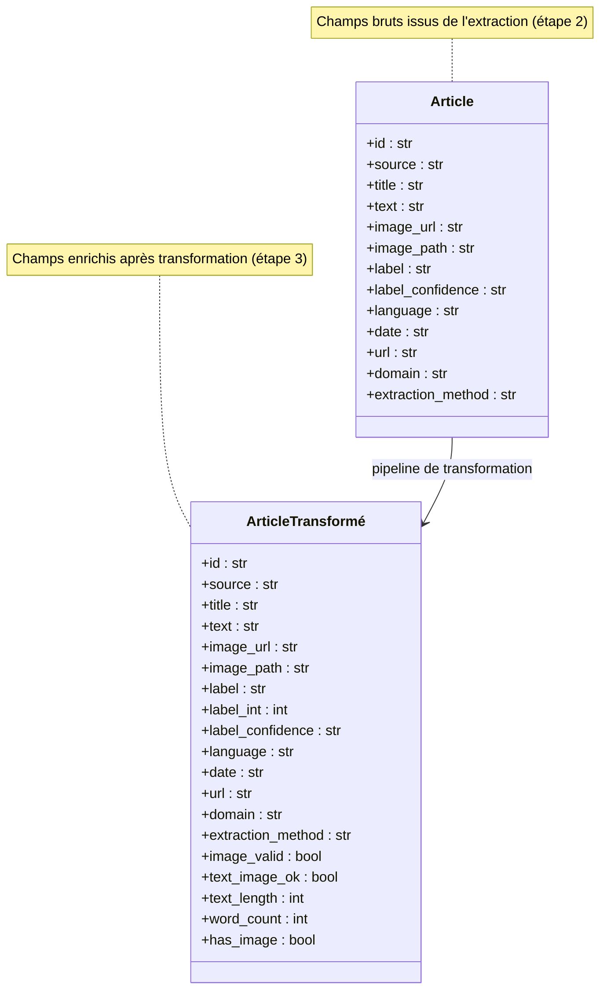
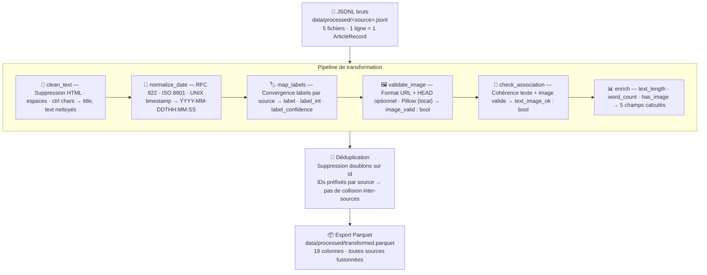

# Schéma conceptuel des données — Détection de Fake News

Modèle conceptuel des données produites par le pipeline (étape 3).
Ce schéma décrit les entités du domaine métier, leurs attributs et leur rôle dans le cas d'usage IA — indépendamment de toute considération technique (SGBD, format de stockage, index).

---

## Entité principale : Article

Un `Article` représente une publication multimodale (texte + image optionnelle) issue d'une source d'information, annotée ou non comme vraie/fausse.

---

## Description des attributs

### Champs d'identification et de traçabilité

| Champ | Type | Rôle |
|-------|------|------|
| `id` | str | Identifiant unique de l'article (UUID v4) |
| `source` | str | Origine de la donnée : `mmfakebench`, `fakeddit`, `miragenews`, `mediaeval`, `rss` |
| `url` | str | URL d'origine de l'article (vide si absent) |
| `domain` | str | Domaine de la source (ex: `reddit.com`, `lemonde.fr`) |
| `extraction_method` | str | Méthode d'extraction : `dataset` ou `rss` |
| `date` | str | Date de publication, normalisée ISO 8601 (`YYYY-MM-DDTHH:MM:SS`) |
| `language` | str | Code langue ISO 639-1 (`en`, `fr`, `hi`…) |

### Contenu textuel (NLP)

| Champ | Type | Rôle |
|-------|------|------|
| `title` | str | Titre de l'article, nettoyé (HTML supprimé, espaces normalisés) |
| `text` | str | Corps textuel principal, nettoyé — entrée principale des modèles NLP |
| `text_length` | int | Nombre de caractères du texte nettoyé — filtrage, normalisation |
| `word_count` | int | Nombre de mots — descripteur pour l'analyse exploratoire et le filtrage |

### Contenu image (multimodal)

| Champ | Type | Rôle |
|-------|------|------|
| `image_url` | str | URL publique de l'image associée (vide si absent) |
| `image_path` | str | Référence interne (ex: chemin HuggingFace) quand pas d'URL publique |
| `image_valid` | bool | L'URL ou le chemin image est exploitable (format et schéma valides) |
| `has_image` | bool | L'article dispose d'une image valide — filtre pour les modèles multimodaux |
| `text_image_ok` | bool | Texte ET image présents — cohérence de la paire pour l'entraînement multimodal |

### Annotation (classification)

| Champ | Type | Rôle |
|-------|------|------|
| `label` | str | Label textuel : `real`, `fake`, `unknown` |
| `label_int` | int | Label numérique : `real=1`, `fake=0`, `unknown=-1` — cible de classification |
| `label_confidence` | str | Confiance de l'annotation : `high` (annoté par experts), `medium` (implicite) |

---

## Pipeline de transformation

---

## Sources de données

| Source | Type | Langue | Labels | Volume indicatif |
|--------|------|--------|--------|-----------------|
| MMFakeBench | Dataset HuggingFace | EN | real / fake | ~11 000 |
| Fakeddit | Dataset CSV | EN | real / fake | 10 000 (limité) |
| MiRAGeNews | Dataset HuggingFace | EN | real / fake (image AI-générée) | ~15 000 |
| MediaEval VMU | Archives GitHub | EN | real / fake / non-verifiable | ~2 177 |
| RSS (Le Monde, BBC, The Guardian, Snopes) | Flux live | FR/EN | real (implicite) / fake (Snopes) | 500 (limité) |
